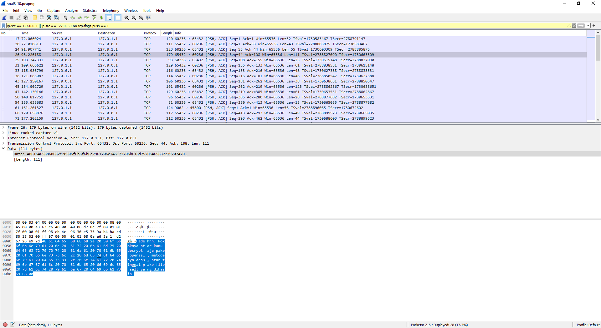
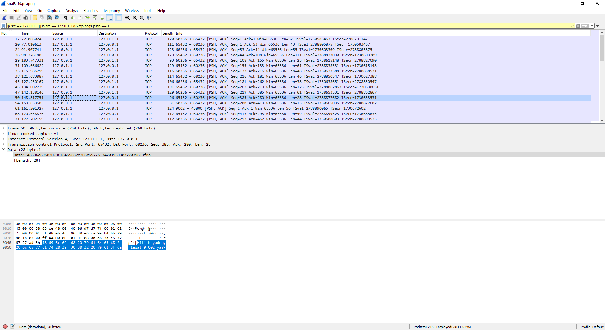
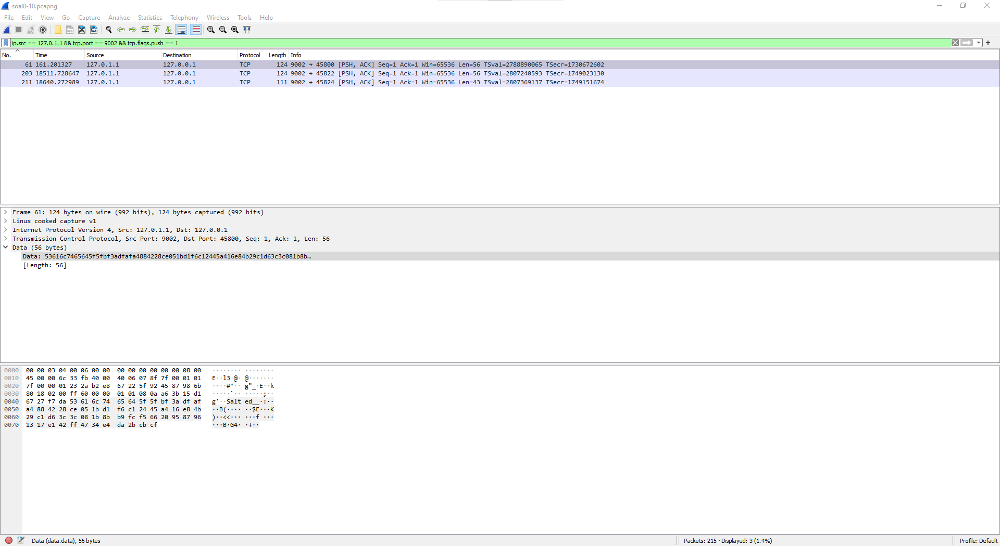

# Jarkom-Modul-1-I01-2022

**Computational Networking Module 1 Practicum Report**

Group Members:

+ Adam Satria Adidarma - 05111942000001
+ Muhammad Fatih Akbar - 5025201117
+ Rangga Aulia Pradana - 5025201154

## Important Links

+ [Questions](https://docs.google.com/document/d/1e5fXdleV59vFthVeK0O5WfmuOYV6xi6WkpHsZEiBofE/edit?usp=sharing)
+ [Resources](https://drive.google.com/drive/folders/1mj1IKV1_NPWtz7AcIytw4DK8vC9fZ1Ox?usp=sharing)

## Table of Contents

- [Jarkom-Modul-1-I01-2022](#jarkom-modul-1-i01-2022)
  - [Important Links](#important-links)
  - [Table of Contents](#table-of-contents)
  - [Answers](#answers)
    - [Question 1](#question-1)
    - [Question 2](#question-2)
    - [Question 3](#question-3)
    - [Question 4](#question-4)
    - [Question 5](#question-5)
    - [Question 6](#question-6)
    - [Question 7](#question-7)
    - [Question 8](#question-8)
    - [Question 9](#question-9)
    - [Question 10](#question-10)
  - [Revisions](#revisions)

## Answers

### Question 1

> Mention the web server used on "monta.if.its.ac.id"!

Jawaban, Penjelesan,& Screenshot di sini!
<!--- Buat files/screenshot bisa di taro di folder contents aja --->

### Question 2

> Ishaq was confused looking for TA topics for this semester, then he came to the monta website and found the topic details on the website “monta.if.its.ac.id”, what TA title did Ishaq open?

Jawaban, Penjelesan,& Screenshot di sini!
<!--- Buat files/screenshot bisa di taro di folder contents aja --->

### Question 3

> Filter so that wireshark only shows packets going to port 80!

Jawaban, Penjelesan,& Screenshot di sini!
<!--- Buat files/screenshot bisa di taro di folder contents aja --->

### Question 4

> Filter so that wireshark only picks up packets coming from port 21!

Jawaban, Penjelesan,& Screenshot di sini!
<!--- Buat files/screenshot bisa di taro di folder contents aja --->

### Question 5

> Filter so that wireshark only picks up packets coming from port 443!

Jawaban, Penjelesan,& Screenshot di sini!
<!--- Buat files/screenshot bisa di taro di folder contents aja --->

### Question 6

> Filter so that wireshark only shows packets going to lipi.go.id !

Jawaban, Penjelesan,& Screenshot di sini!
<!--- Buat files/screenshot bisa di taro di folder contents aja --->

### Question 7

> Filter so that wireshark only picks up packets coming from your ip!

Jawaban, Penjelesan,& Screenshot di sini!
<!--- Buat files/screenshot bisa di taro di folder contents aja --->

### Question 8

> Browse the flow of packets in the given .pcap file, look for useful information in the form of a conversation between two students regarding cheating in practicum activities. The conversation is reported to use a network protocol with a high level of reliability in its data exchange so you need to apply a filter with that protocol.

Jawaban, Penjelesan,& Screenshot di sini!
<!--- Buat files/screenshot bisa di taro di folder contents aja --->

### Question 9

> There are reports of file exchanges made by the two students in the conversations obtained, look for the file in question! To facilitate reporting to superiors, name the file found in the format **[group_name].des3** and save the output file with the name **“flag.txt”.**

Using the IPs of the two perpetrator ,`127.0.0.1` & `127.0.1.1`, knowing that one of them is the supplier (`127.0.1.1`) we can find any clue to lead where the supplier would send its file. By following the conversation using the previous display filter we would find the following:

From this we know that the file would be encrypted under a **.des3** file format (as so, it would be most likely be gibberish or salted in its raw form.), and that it would be sent over **"9002"** which is a port number. Using this newfound knowledge, we could use the following display filter:

`ip.src == 127.0.1.1 && tcp.port == 9002 && tcp.flags.push == 1`

in which it would display:

here we would find the salted data in which is the file in question. As we are asked to export the content to a file, we would export the **raw data** from WireShark and export it to a file named **I01.des3**.

The data in its raw form: 
`53616c7465645f5fbf3adfafa4884228ce051bd1f6c12445a416e84b29c1d63c3c081b8bb9fcf566209587961317e142ff4734e4da2bcbcf`

the output of the decryption (**flag.txt**) will be discussed in the next question.

### Question 10

> Find the secret password (flag) of the above-mentioned underground organization!

Jawaban, Penjelesan,& Screenshot di sini!
<!--- Buat files/screenshot bisa di taro di folder contents aja --->

## Revisions

+ Perubahan & Revisi di tulis di sini.