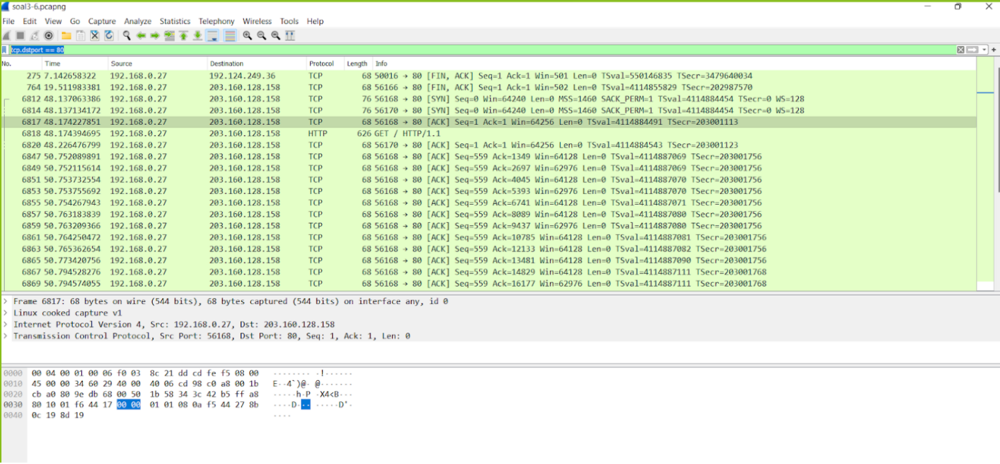
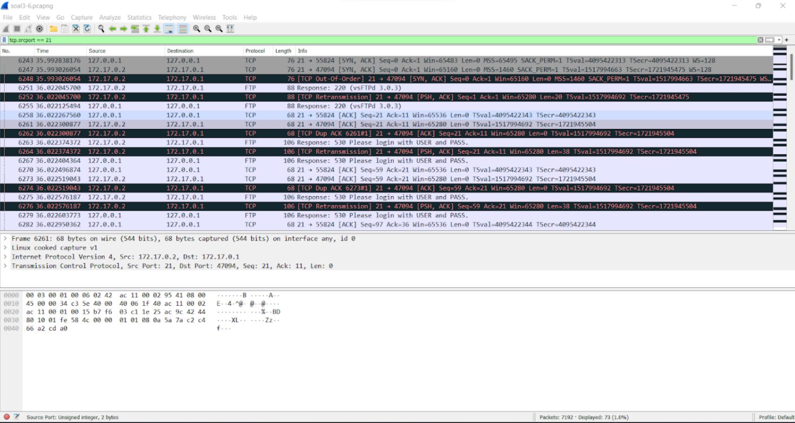
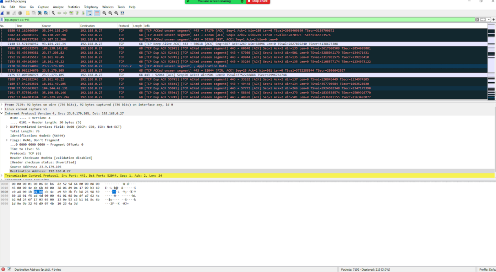
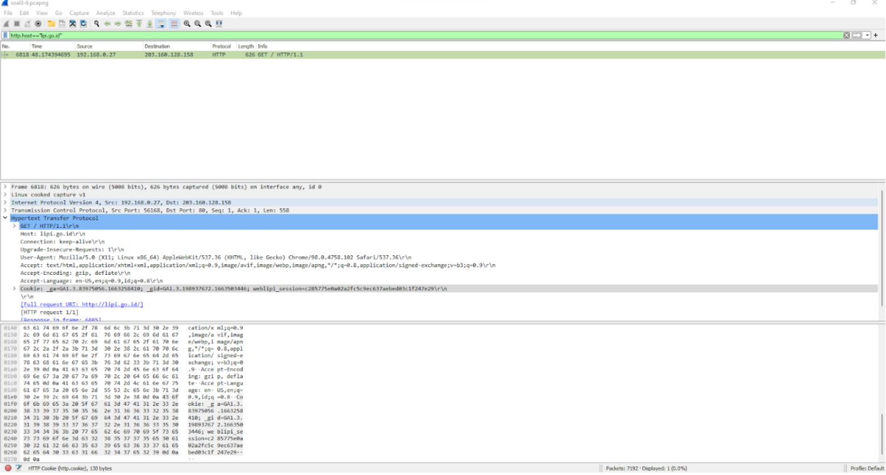
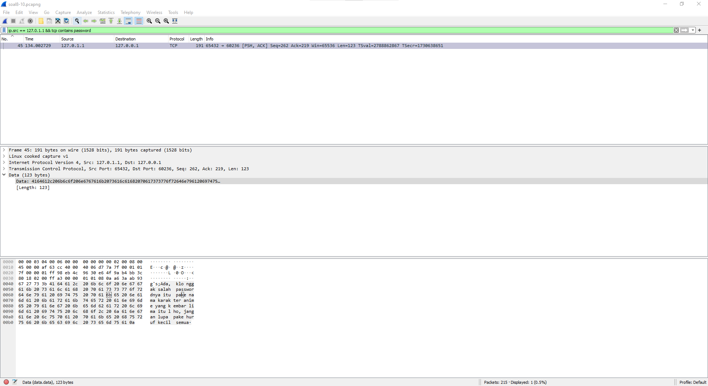
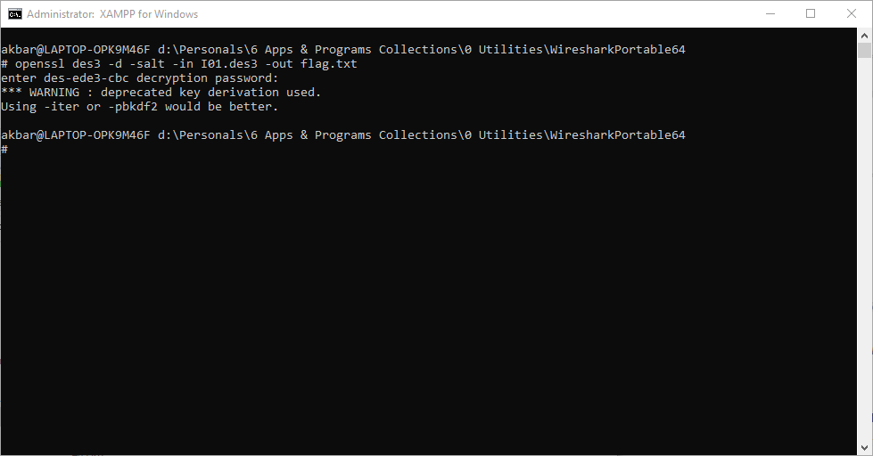
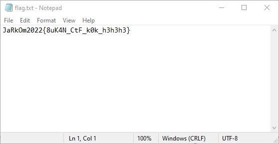

# Jarkom-Modul-1-I01-2022

**Computational Networking Module 1 Practicum Report**

Group Members:

+ Adam Satria Adidarma - 05111942000001
+ Muhammad Fatih Akbar - 5025201117
+ Rangga Aulia Pradana - 5025201154

## Important Links

+ [Questions](https://docs.google.com/document/d/1e5fXdleV59vFthVeK0O5WfmuOYV6xi6WkpHsZEiBofE/edit?usp=sharing)
+ [Resources](https://drive.google.com/drive/folders/1mj1IKV1_NPWtz7AcIytw4DK8vC9fZ1Ox?usp=sharing)

## Table of Contents

- [Jarkom-Modul-1-I01-2022](#jarkom-modul-1-i01-2022)
  - [Important Links](#important-links)
  - [Table of Contents](#table-of-contents)
  - [Answers](#answers)
    - [Question 1](#question-1)
    - [Question 2](#question-2)
    - [Question 3](#question-3)
    - [Question 4](#question-4)
    - [Question 5](#question-5)
    - [Question 6](#question-6)
    - [Question 7](#question-7)
    - [Question 8](#question-8)
    - [Question 9](#question-9)
    - [Question 10](#question-10)
  - [Revisions](#revisions)

## Answers

### Question 1

> Mention the web server used on "monta.if.its.ac.id"!

With the help of wireshark filter _tcp.host_, we can see which server are using the tcp protocol to request a GET method to retreive and request data from a specified resource in a server. From our experiment we can see that the web server used by monta.if.its.ac.id was `nginx/1.10.3` shown by the picture below  
MASUKIN GAMBAR

### Question 2

> Ishaq was confused looking for TA topics for this semester, then he came to the monta website and found the topic details on the website “monta.if.its.ac.id”, what TA title did Ishaq open?

By using Ishaq's ip address of `103.94.189.5`, we can filter his network traffic by searching a tcp protocol that is using a GET request which contains topik in the request. We can see in our experiment there is a GET method which request `/index.php/topik/detailTopik/194 HTTP/1.1` by Ishaq. Therefore, we can conclude that this is the topic that Ishaq open. Using our own browser to send a GET request to the server with the same value as Ishaq's, we can see the topic that Ishaq's looking for which is Evaluasi untuk kerja User Space Filesystem (FUSE). 
MASUKIN GAMBAR

### Question 3

> Filter so that wireshark only shows packets going to port 80!

filtering packets that only going to port 80 can be easily done by applying command `tcp.dstport == 80` . by using this command this will sort out all the packets that are only going or assigned to go to port 80  

### Question 4

> Filter so that wireshark only picks up packets coming from port 21!

in order to get information about packets that only coming from port 21 in our network traffic we can do that by applying filter by using command `tcp.srcport == 21` and thus will catch all the packets that are coming from port 21  

### Question 5

> Filter so that wireshark only picks up packets coming from port 443!

We can filter our network traffic coming only from port 443 by using the command `tcp.srcport == 443`. Source port is where the packet/connection originated. Therefore, by using this filter, we can view packets coming only from the port _443_. 

### Question 6

> Filter so that wireshark only shows packets going to lipi.go.id !

To see packets only going to a specific domain, we used `http.host == lipi.go.id`. This filter will show us http requests going to this specific domain which in our case there is only one device trying to send a GET request to this domain from `192.168.0.27`. 

### Question 7

> Filter so that wireshark only picks up packets coming from your ip!

Jawaban, Penjelesan,& Screenshot di sini!
<!--- Buat files/screenshot bisa di taro di folder contents aja --->

### Question 8

> Browse the flow of packets in the given .pcap file, look for useful information in the form of a conversation between two students regarding cheating in practicum activities. The conversation is reported to use a network protocol with a high level of reliability in its data exchange so you need to apply a filter with that protocol.

Jawaban, Penjelesan,& Screenshot di sini!
<!--- Buat files/screenshot bisa di taro di folder contents aja --->

### Question 9

> There are reports of file exchanges made by the two students in the conversations obtained, look for the file in question! To facilitate reporting to superiors, name the file found in the format **[group_name].des3** and save the output file with the name **“flag.txt”.**

Using the IPs of the two perpetrator ,`127.0.0.1` & `127.0.1.1`, knowing that one of them is the supplier (`127.0.1.1`) we can find any clue to lead where the supplier would send its file. By following the conversation using the previous display filter we would find the following:

From this we know that the file would be encrypted under a **.des3** file format (as so, it would be most likely be gibberish or salted in its raw form.), and that it would be sent over **"9002"** which is a port number. Using this newfound knowledge, we could use the following display filter:

`ip.src == 127.0.1.1 && tcp.port == 9002 && tcp.flags.push == 1`

in which it would display:

here we would find the salted data in which is the file in question. As we are asked to export the content to a file, we would export the **raw data** from WireShark and export it to a file named **I01.des3**.

The data in its raw form: 
`53616c7465645f5fbf3adfafa4884228ce051bd1f6c12445a416e84b29c1d63c3c081b8bb9fcf566209587961317e142ff4734e4da2bcbcf`

the output of the decryption (**flag.txt**) will be discussed in the next question.

### Question 10

> Find the secret password (flag) of the above-mentioned underground organization!

After finding the file and exporting it, now we need to decrypt it using a password. To find the password we would just need to find a message from the supplier (`127.0.1.1`) that would contain any mention or keyword of 'password', in which the display filter would be:

`ip.src == 127.0.1.1 && tcp contains password`

where it would display:

>*"Ada, klo nggak salah passwordnya itu pake nama karakter anime yang kembar lima itu lho, jangan lupa pake huruf kecil semua"*

Using this clue, we would find that this leads to the Anime series **Go-tōbun No Hanayome**, an anime that features a quintuplet twins named the **Nakanos**, as so the password is infered to be **nakano**.

To test this we would need to use OpenSSL via Command or Terminal that supports it. For this example we would use the shell terminal provided by XAMPP that have OpenSSL already installed. by putting the command `openssl des3 -d -salt -in [des3 File location] -out flag.txt` (des3 since its the format, -d because we're decrypting, -salt because the file is salted) and then putting in the password we would get the following output:

## Revisions

+ Continued Number 9 & 10, since it was previously left incomplete.
